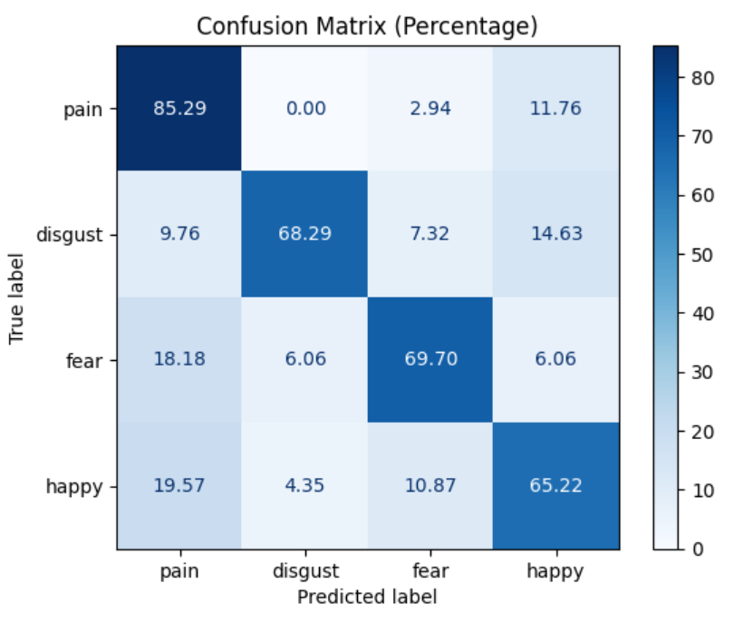
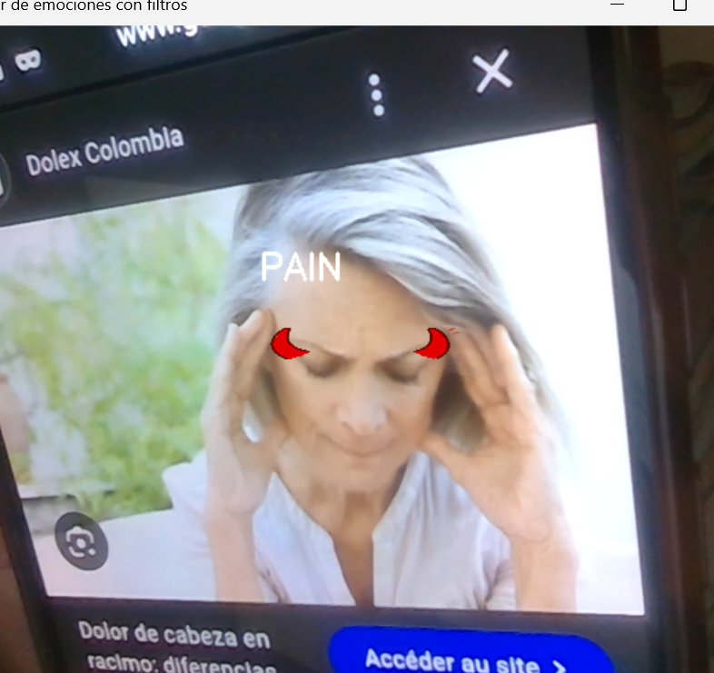
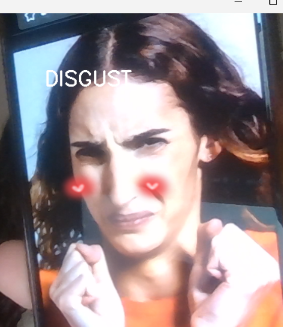
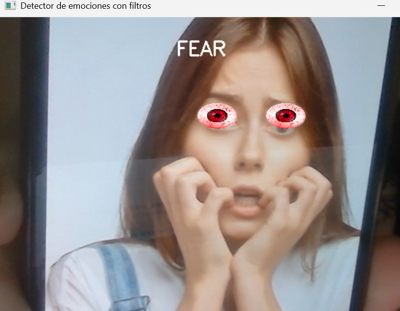
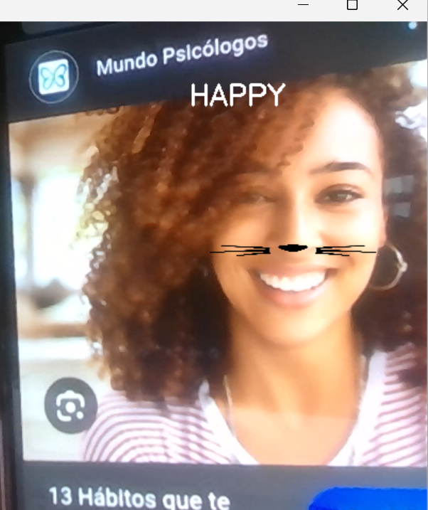

# Práctica 5 - Detector de Emociones con Filtros en Tiempo Real

Práctica realizada por Lucía Motas Guedes y Raúl Marrero Marichal.

Este proyecto implementa un **sistema de detección de emociones faciales en tiempo real** mediante **transfer learning con ResNet18** y la aplicación de **filtros PNG con transparencia**, capaces de:

* Detectar 4 emociones: `pain`, `disgust`, `fear` y `happy`.
* Aplicar filtros específicos a cada emoción sobre la cara detectada.
  * `pain`: cuernos rojos en la parte superior del rostro.
  * `disgust`: corazones en las mejillas.
  * `fear`: se utilizó un png de un ojo irritado y se utilizó para ambos ojos.
  * `happy`: nariz y bigotes de gato en la mitad del rostro.
* Mostrar la emoción detectada sobre la cara en tiempo real.
* Evaluar el modelo con métricas y mostrar la **matriz de confusión** en porcentaje.

---

## Estructura del Proyecto

```bash
├── data/
│   ├── filters/              # PNGs de filtros con fondo transparente
│       ├── pain.png
│       ├── disgust.png
│       ├── fear.webp
│       └── happy.png
│   ├── images/               # Todas las imágenes originales
│   ├── emotions/             # CSV con imágenes de entrenamiento por emoción
│   └── Prueba/               # CSV con imágenes de test por emoción
│
├── results/                  # Imágenes de test con nombre de emoción
│   ├── pain.png
│   ├── disgust.png
│   ├── fear.png
│   ├── happy.png
│   └── matrix.png
│
├── img/                      # Imágenes para filtro
│   ├── clown_nose.png        
│   ├── clown_wih.png            
├── modelo_emociones.pth      # Modelo entrenado con ResNet18
├── VC_P5.ipynb               # Cuaderno con el desarrollo de la práctica
├── divide.py                 # Script para organizar los datos de kaggle
├── filter.mp4                # Vídeo de muestra del filtro
└── README.md
```

> Nota: Se utiliza **OpenCV** para la captura de cámara y detección de caras (Haar Cascade).

---

## 1. Configuración del Entorno

Requiere Python 3.9+ y, opcionalmente, soporte CUDA para GPU.

```bash
# === Crear el entorno virtual ===
python -m venv VC_P5

# === Activar el entorno ===
.\VC_P5\Scripts\activate

# === Instalar PyTorch compatible con CUDA 12.x === pip install torch torchvision torchaudio --index-url https://download.pytorch.org/whl/cu121 # o cu126

# === Instalar dependencias ===
pip install opencv-python matplotlib pandas scikit-learn pillow numpy
```

---

## 2. Dataset

Se utilizó el dataset de Kaggle: [Sentiment Images Classifier](https://www.kaggle.com/datasets/yousefmohamed20/sentiment-images-classifier).

### Organización del dataset

```bash
dataset/
├──  anger/
├── disgust/
├──  fear/
├── happy/
├──  pain/
└── sad/
```

Después de ejecutar el script:

```bash
├── data/
│   ├── images/               # Todas las imágenes originales
│   ├── emotions/             # CSV con imágenes de entrenamiento por emoción
│   └── Prueba/               # CSV con imágenes de test por emoción
```

> Los CSVs contienen dos columnas: `filename` (ruta de la imagen) y `label` (entidad numérica de la emoción).
> Se filtraron solo 4 emociones para este proyecto: `pain`, `disgust`, `fear` y `happy`.
> Por tanto, se mapean para solo utilizar las 4 elegidas.

---

## 3. Entrenamiento del Modelo

* Se utilizó **ResNet18 preentrenado** mediante **transfer learning**.
* Se congelaron todas las capas excepto las últimas 3 y la capa fully connected.
* La última capa se reemplazó por una capa lineal adaptada a 4 clases (emociones).
* Optimización: `Adam`, función de pérdida `CrossEntropyLoss`.
* Entrenamiento: 5 epochs, batch size 64.

### Métricas por epoch

| Epoch | Loss   | Accuracy |
| ----- | ------ | -------- |
| 1     | 1.0100 | 61.68%   |
| 2     | 0.3572 | 86.35%   |
| 3     | 0.1695 | 93.91%   |
| 4     | 0.1324 | 96.22%   |
| 5     | 0.0741 | 97.53%   |

```python
# Ejemplo de modificación de la última capa
model = models.resnet18(pretrained=True)
for layer in list(model.children())[:-3]:
    for param in layer.parameters():
        param.requires_grad = False
model.fc = nn.Linear(model.fc.in_features, 4)
```

> La red **no presentó overfitting** durante el entrenamiento: la precisión aumentó de manera constante y la pérdida disminuyó sin que los valores se estabilizaran prematuramente.
> Accuracy en test: **73.38%**

---

## 4. Evaluación del Modelo

* Cálculo de **accuracy** sobre el conjunto de test.
* Generación de la **matriz de confusión en porcentaje**:

```python
from sklearn.metrics import confusion_matrix, ConfusionMatrixDisplay

cm = confusion_matrix(all_labels, all_preds)
cm_percentage = cm.astype('float') / cm.sum(axis=1)[:, np.newaxis] * 100
disp = ConfusionMatrixDisplay(confusion_matrix=cm_percentage, display_labels=emociones)
disp.plot(cmap='Blues', values_format=".2f")
```

    

---

## 5. Detección de Emociones en Tiempo Real

* **Webcam** + **Haar Cascade** para detectar caras.
* **Transformación de imágenes**: resize a 128x128, normalización.
* **Predicción de emoción** mediante el modelo entrenado.
* **Aplicación de filtros** PNG con transparencia:

Las imágenes de `results/` se usan para mostrar cómo quedan los filtros aplicados:

| Emoción         | `pain`                    | `disgust`                       | `fear`                    | `happy`                     |
| --------------- | ------------------------- | ------------------------------- | ------------------------- | --------------------------- |
| Imagen Original |  |  |  |  |
| Filtro Aplicado | Cuernos rojos             | Corazones en mejillas           | Ojos duplicados           | Nariz y bigotes             |

* Los filtros con alpha se superponen respetando la transparencia.
* En `fear`, el filtro se duplica para ambos ojos.

---

## 6. Detección en Tiempo Real

* **Webcam** + **Haar Cascade**.
* Transformación: 128x128 y normalización.
* Predicción con ResNet18 entrenado.
* Filtros PNG con transparencia aplicados según la emoción.
* Para `fear`, la imagen se duplica en ambos ojos.

---

## 6. Consideraciones

* Haar Cascade mantiene robustez frente a ángulos complicados.
* Se mantiene la **detección de caras con Haar Cascade** porque Mediapipe puede fallar en ciertos ángulos de webcam.
* El modelo no sobreentrenó, las epochs se ajustaron correctamente y se obtuvo un buen compromiso entre train y test accuracy.
* La matriz de confusión permite identificar qué emociones se confunden más y evaluar el desempeño real del modelo.
* Se mantiene la **detección de caras con Haar Cascade** porque Mediapipe puede fallar en ciertos ángulos de webcam y empeorar la detección de emociones.
* Los PNGs se cargan con canal alpha para mantener transparencia.

## Filtro

Para esta parte de la práctica, se hace uso de `RetinaFace` sin el uso de `DeepFace` y los landmarks para hacer un filtro que coloca una peluca y una nariz de payaso en todas las caras que detecte. Incluso usando una GPU, el programa tarda considerablemente en procesar cada frame, pero con excelentes resultados.

El filtro es capaz de escalar las imágenes en función del tamaño de la cara detectada (y por tanto, de la distancia a la cámara) y también de detectar los giros verticales de la cabeza para rotar las imágenes y su posición correctamente.

Hace uso de la posición de los ojos y la nariz para ajustar automáticamente la escala, rotación y posición anteriormente mencionados.

### 1. Identificación de la cara

La detección de la cara se hace usando `RetinaFace.detect_faces(frame)` que devuelve un diccionario.

```python
id = 'face_' + str(idx)
print(faces[id])
facial_area = faces[id]['facial_area']
landmarks = faces[id]['landmarks']
```

- Cada cara detectada se identifica mediante un ID (`face_0`, `face_1`, …).
- `facial_area` contiene el bounding box de la cara `[x_min, y_min, x_max, y_max]`.
- `landmarks` contiene las posiciones de los elementos faciales clave: ojos, nariz, boca, etc.

### 2. Escalado de las imágenes

```python
  scale = (facial_area[2]-facial_area[0])/2000

  nariz_scaled = cv2.resize(nariz, (int(nariz.shape[1] * scale), int(nariz.shape[0] * scale)), interpolation=cv2.INTER_AREA)

  peluca_scaled = cv2.resize(peluca, (int(peluca.shape[1] * scale*2.5), int(peluca.shape[0] * scale*2.5)), interpolation=cv2.INTER_AREA)
```

- Se calcula una escala relativa al ancho de la cara para ajustar los accesorios proporcionalmente.
- `nariz_scaled` y `peluca_scaled` son las imágenes ajustadas para encajar en la cara detectada.
- Se usa la interpolación `INTER_AREA` para mantener la calidad al reducir el tamaño.

### 3. Cálculo del ángulo de inclinación de los ojos 

```python
angle_rad = -(np.arctan2(landmarks["right_eye"][1]-landmarks["left_eye"][1], landmarks["right_eye"][0]-landmarks["left_eye"][0]))+np.pi
angle = np.rad2deg(angle_rad)
```

- Se calcula el ángulo de la línea que une los ojos respecto a la horizontal.
- Esto permite rotar la peluca y la nariz para que sigan la inclinación de la cabeza.
- Se convierte a grados porque `cv2.getRotationMatrix2D` usado en la función `superponer_imagen` utiliza grados.

### 4. Cálculo del centro de los ojos con offset para la peluca

```python
p1 = np.array([landmarks["right_eye"][0], landmarks["right_eye"][1]])
p2 = np.array([landmarks["left_eye"][0], landmarks["left_eye"][1]])
dist = int(-np.linalg.norm(p2 - p1))

offset_y = dist*1.1
offset_y = offset_y * np.cos(angle_rad)
offset_x = offset_y * np.sin(angle_rad)

eyes_center_x = ((int(landmarks["right_eye"][0])+int(landmarks["left_eye"][0]))/2)+offset_x
eyes_center_y = ((int(landmarks["right_eye"][1])+int(landmarks["left_eye"][1]))/2)+offset_y
```

- `dist` mide la distancia entre los ojos (negativa para mover hacia arriba).
- `offset_y` desplaza la peluca hacia arriba de los ojos, multiplicado por un factor `1.1` para que quede por encima de la frente.
- `offset_x` y `offset_y` se rotan según el ángulo de la cabeza (angle_rad) para que el desplazamiento siga la inclinación de los ojos.
- (`eyes_center_x`, `eyes_center_y`) es el centro final donde se colocará la peluca.

### 5. Aplicación de filtro

```python
frame = superponer_imagen(frame, nariz_scaled, int(landmarks["nose"][0]), int(landmarks["nose"][1]), angle)
frame = superponer_imagen(frame, peluca_scaled, eyes_center_x, eyes_center_y, angle)
```

- `superponer_imagen` coloca la imagen sobre el `frame`.
- La nariz se coloca centrada en el landmark de la nariz.
- La peluca se coloca centrada en `eyes_center`, usando el ángulo calculado para rotarla según la inclinación de la cabeza.
- La función maneja transparencia, recorte automático y rotación.

## Resultado

https://github.com/user-attachments/assets/41b6581a-09c8-45d2-aa9e-633e9dff05b8


